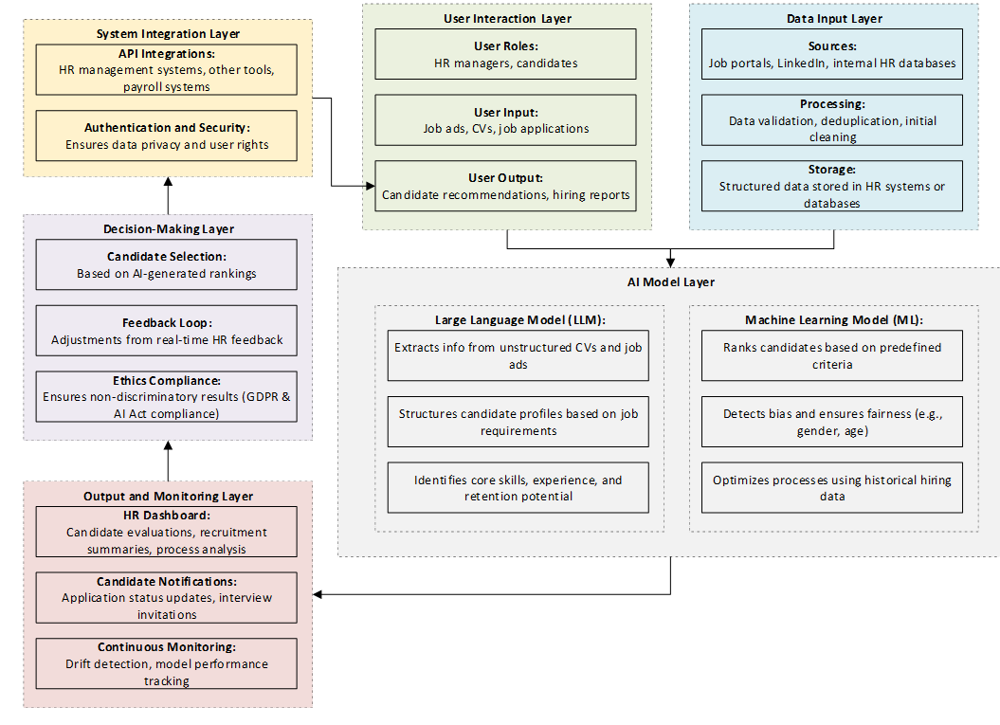
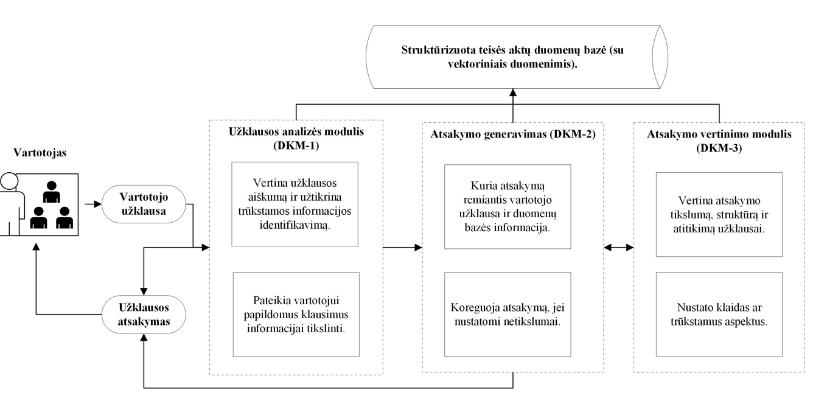
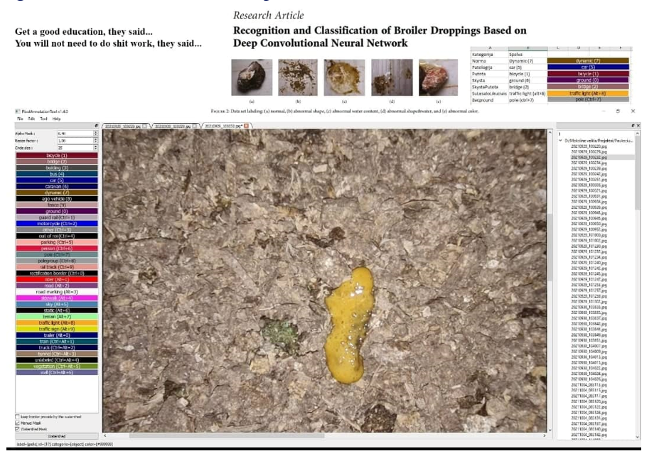
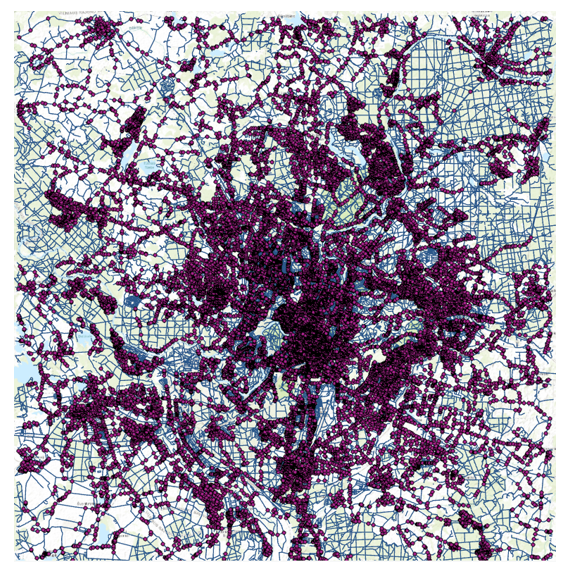

Human Resources – AI recruiting platform

What it does
An end-to-end assistant for talent teams: harvests job ads and CVs, extracts structured profiles, ranks candidates, schedules interviews, and produces hiring reports. 

Users and context
HR managers and recruiters; candidates interact for notifications and scheduling. Integrates with job boards, LinkedIn, HRIS, and payroll. 

Data and models
Data from job portals, company HR databases, and public profiles. LLMs extract entities and normalize skills from unstructured CVs and ads; ML ranking models score fit and retention potential; bias checks flag sensitive attributes; drift monitors track data and performance. 

Workflow
Ingestion and cleansing → profile extraction → ranking and shortlist → auto-scheduling → HR dashboard with feedback loop to improve rankings. 

Value
Shorter time-to-shortlist, fewer manual screens, better candidate experience, and auditable fairness checks. 

Governance
High-risk triggers around employment. Needs lawful basis for data, bias and equal-treatment testing, explainable criteria for ranking, and human-in-the-loop for final decisions. 

Build notes
Start with extraction quality and a transparent, tunable ranking model; log every decision with features used; route low-confidence or potentially biased cases to humans.

SocBot – assistant for social workers

What it does
Answers frequent questions, drafts notes and recommendations, and proposes options aligned to social-work best practices. Not a decision maker; supports professionals. 

Users and context
Public and NGO social-service workers serving seniors, children, and people in crisis. 

Data and models
Ethnographic interviews with 20 practitioners; ~1,200 human-labeled Q&A pairs plus ~1,200 synthetic dialogues to fill gaps; fine-tuned LLM evaluated by domain experts. 

Workflow
Prompt library for common scenarios → retrieval of local policy snippets → suggestion generation with caveats → human review → feedback loop to refine prompts and model. 

Value
Reduces routine cognitive load, speeds documentation, standardizes language and references. 

Governance
Low–medium risk as an internal decision-support tool with oversight. Direct use by citizens could cross into access-to-services risk and requires stronger controls. 

Build notes
Keep an explicit “this is not advice” banner and require selection of a policy basis for every suggestion; log what was cited.

Lithuanian text simplification (ETR)

What it does
Converts standard Lithuanian texts to easy-to-read versions for people with intellectual disabilities or language barriers. 

Data and models
Lt-LLaMA-2 adapted on 125 original–simplified pairs (public sources). Prompting techniques and automatic evaluation (SARI metric ~55.65 on EXP4; GPT-4 ratings for clarity). Plans for RLHF and larger datasets. 

Value
Improves access to public information and services. 

Governance
High-risk flags if used for political, legal, health, or essential-services content; must add disclaimers, provenance, human review, and domain-specific guards. 

Build notes
Expand parallel corpora; add domain style guides; automatic checks for meaning preservation and reading level before release.

Legal drafting assistant (RAG over vectorized laws)

What it does
Drafts and refines legal documents; answers questions about statutes; generates clarifying questions; and evaluates outputs with a second model. 

Data and models
Sources include national and EU legislation, ministerial documents, and explanatory notes. Text is split into articles/sections, embedded, and indexed with links among related acts. LLMs perform retrieval-augmented generation and structured drafting; a reviewer model checks accuracy, structure, and task fit. 

Workflow
Query → clarifying questions → retrieval of relevant provisions → draft with citations → automated critique → human edit → export. API available for systems and LLMs. 

Value
Cuts drafting time, improves citation hygiene, and standardizes structures. 

Governance
Legal domain sits near high-risk boundaries. Require traceable citations, versioned sources, and human approval. Avoid giving legal advice to consumers; position as professional support.

Poultry health monitoring

What it does
Computer-vision pipeline to detect signs of illness in chicks from video or images for early intervention. 

Data and models
Barn cameras; thermal or RGB feeds; supervised models to detect anomalies in movement, posture, or density. 

Value
Earlier disease detection, reduced mortality, targeted treatment, and better welfare compliance. 

Governance
Animal-welfare reporting and biosecurity; ensure privacy if facilities include staff video.

City traffic forecasting for dynamic routing (Vilnius)

What it does
Predicts traffic by the hour for dynamic delivery routing. Built with two years of measurements from 1,560 detectors, Copernicus CERRA weather, and graph neural networks for interpolation and prediction. 

Users and context
E-grocery and last-mile fleets; dispatchers and routing engines. 

Value
Higher on-time delivery, less spoilage, lower fuel use; useful for peak planning and incident response. 

Build notes
Keep detectors’ health monitoring, weather nowcasts, and fallback heuristics for outages.

Real-estate valuation and market simulation

What it does
Combines regional price and risk forecasts with what-if analysis and correction coefficients for specific properties; supports financial modeling and policy scenarios. 

Data and models
Market indicators and asset-specific attributes; simulations and scenario analysis for long-term value change and regional risk. 

Use cases
Collateral valuation, planning, and tokenized-asset pricing experiments. 

Solar panel detection

What it does
Remote-sensing model to locate PV installations for grid planning, incentive audits, and roof-top potential mapping. 

Data and models
High-resolution imagery; object detection/segmentation with QA sampling.

Real-time peatland moisture maps (data fusion + deep learning)

What it does
Predicts peat moisture to prevent degradation, support agriculture, and inform climate action. Uses multispectral, hyperspectral, and SAR sensors (Sentinel-1/2, TerraSAR-X, CHRIS/Proba), fused with local measurements. Field validation uses ADAM PMB202 analyzers; processing with Earth Engine and Copernicus hubs. 

Value
Early warning for fire and subsidence risk; targeted water management; environmental compliance.

## LLM market reaserch

## LLM project writing