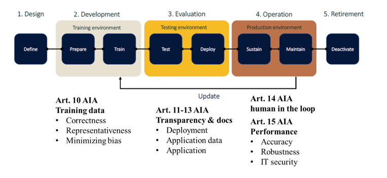
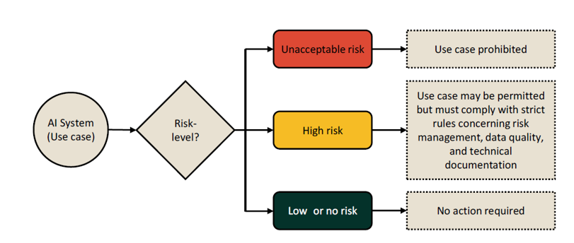
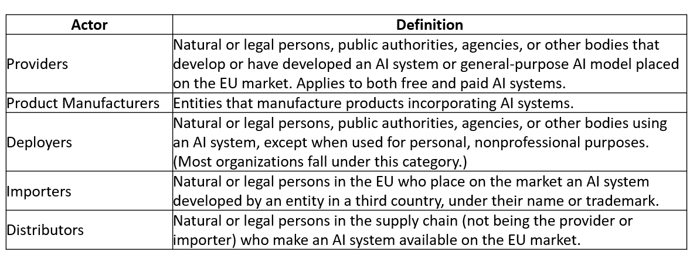
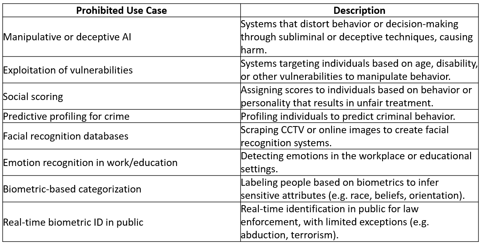
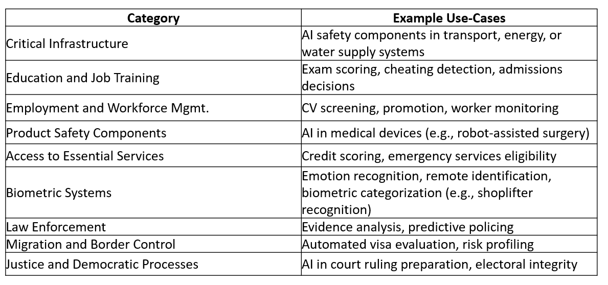
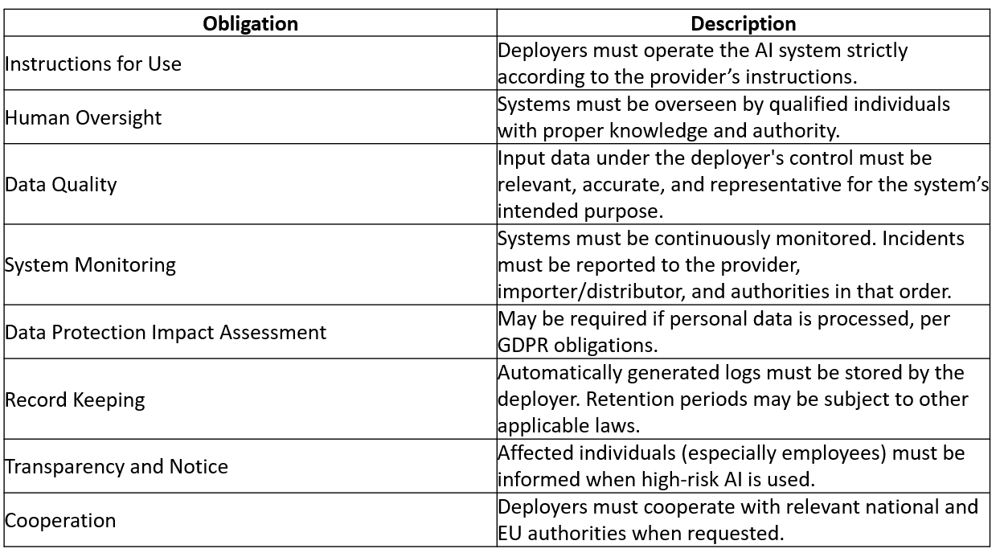
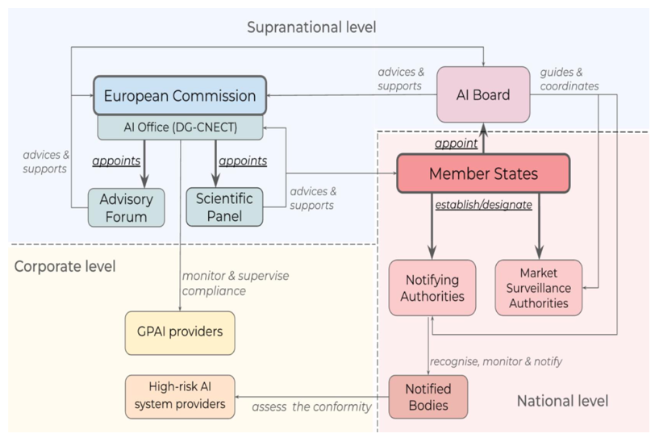
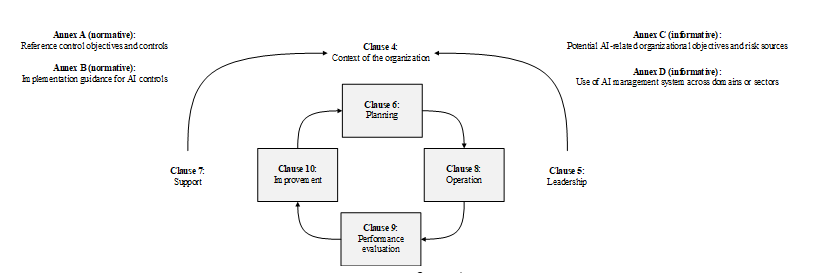

## AI Act Overview and CapAI Guidelines

The Artificial Intelligence Act (AIA) was accepted in August 2024, setting the foundation for regulating AI systems within the European Union. The Act introduces a comprehensive framework aimed at ensuring that AI systems operating in the EU are trustworthy, legally compliant, and ethically sound. It emphasizes the classification of AI systems based on risk, focusing particularly on high-risk AI systems, which are subject to stricter rules concerning safety, transparency, and risk management. These high-risk systems include those used in areas such as law enforcement, recruitment, and healthcare.
The AI Act mandates a certification process for AI systems, ensuring that they meet these requirements before being deployed in the market. However, one significant challenge the Act presents is the absence of detailed practical guidelines on how organizations can comply with these rules. This is where CapAI, a conformity assessment procedure developed by the University of Oxford, comes into play. CapAI offers structured guidance, particularly in addressing how organizations can navigate the AI lifecycle, which is crucial for aligning with the Act’s requirements.

The machine learning (ML) lifecycle forms the core structure for AI system development, comprising distinct stages that guide the process from inception to eventual deactivation. Each stage is crucial for ensuring that AI systems are compliant with legal, ethical, and technical standards, especially in light of the AI Act (AIA). The lifecycle includes:
1.	Design: This stage defines the objectives and ethical values that guide the entire development process. It's the starting point where the requirements for the AI system are outlined, ensuring that both the technical specifications and ethical considerations are clearly mapped out. Article 10 of the AI Act is relevant here, as it sets the baseline for the development process by ensuring transparency and risk management from the start.
2.	Development: In this phase, data is prepared, and models are trained within a controlled training environment. Ensuring data quality, fairness, and robustness are key to minimizing risks and ensuring compliance with the AI Act. The Act’s requirements around data governance and transparency are especially important during the training stage.
3.	Evaluation: Once trained, the AI system is tested in a testing environment using unseen data to ensure performance, fairness, and compliance with ethical norms. This stage is crucial for validating the AI's performance under different scenarios and detecting any biases or risks before deployment. Article 14 of the AI Act emphasizes the importance of monitoring during and after testing to ensure the AI operates within legal frameworks.
4.	Operation: After successful evaluation, the AI system is deployed into the production environment. During operation, continuous monitoring and maintenance are essential to ensure that the system remains compliant with ethical, legal, and performance requirements. Sustaining the system and ensuring updates or improvements align with regulations is key during this stage.
5.	Retirement: When an AI system no longer meets operational or ethical standards, it enters the retirement phase. This involves either deactivation or an update to ensure continued compliance, maintaining the integrity of the system within legal boundaries.
This lifecycle, supported by Articles 10 and 15 of the AI Act, provides a structured framework for ensuring that AI systems adhere to the required compliance and risk management standards throughout their entire lifecycle. The accompanying figure visualizes this process, highlighting the transitions between stages and the environments in which development and operation occur.
The integration of this figure offers a clearer view of how AI systems evolve through these stages, from initial design to retirement, emphasizing the continuous monitoring required for compliance with the AI Act. CapAI addresses each of these stages by providing an internal review protocol (IRP) that helps organizations ensure that their systems adhere to ethical standards, legal norms, and technical robustness at every stage of the AI lifecycle. For example, during the design phase, CapAI recommends identifying the ethical values that will guide development, while in the evaluation phase, it emphasizes rigorous testing to ensure the AI system is fair and unbiased.

Furthermore, the AI Act introduces a risk classification system, dividing AI systems into three levels:
•	Unacceptable risk: Systems in this category are banned outright. Examples include social scoring algorithms used by governments and certain real-time biometric systems.
•	High risk: Systems like those used in employment, education, or critical infrastructure fall under this category and must comply with stringent rules regarding risk management, data quality, and technical documentation.
•	Low or minimal risk: These systems require no specific actions or compliance measures, although good practices are encouraged.
This risk classification, visualized in Figure 2, helps to clarify which AI systems are subject to stricter regulatory scrutiny. For more details on how the ML lifecycle aligns with the AI Act. While the AI Act provides a robust regulatory framework, tools like CapAI are essential for offering organizations the practical guidance they need to comply, ensuring their AI systems are both ethical and technically sound throughout the ML lifecycle.

## GENERAL PURPOSE MODELSSYSTEMIC RISK

## General-purpose AI models: what the EU regulates

General-purpose AI models (GPAI) are versatile models that can perform a wide range of tasks, including today’s generative systems such as large language models and diffusion models. They are model components, not complete AI systems by themselves; to become a system, extra parts like interfaces and integrations are added. Typical indicators include at least about a billion parameters and training with massive datasets via self-supervision.&#x20;

### GPAI model vs GPAI system

A GPAI model is the underlying capability; a GPAI system is a deployable product built on top of it. A narrow tool that only translates text is not considered a general-purpose system because it lacks the broad multi-task versatility of the underlying model. GPAI systems can overlap with high-risk AI systems, or be embedded within them.&#x20;

### Who is in scope and when

If you provide a GPAI model, you have provider obligations even if others build the user-facing product. If you fine-tune or otherwise modify an existing GPAI model with specialized data, you become the provider of a modified GPAI model; this does not turn it into a system by itself. Your duties concentrate on the modification: maintain technical documentation and provide a summary of the training data used for the fine-tune.&#x20;

### Transparency and information-sharing

Providers of GPAI models must ensure transparency toward the EU AI Office and national authorities, and toward downstream providers who integrate these models into their own AI systems. The law expects timely, usable information so integrators can meet their obligations.&#x20;

### GPAI models with systemic risk

Some GPAI models are powerful enough to create serious, wide-reaching harms (major accidents, disruption of critical sectors, public-health or safety harm, democratic or economic destabilization, or large-scale spread of false or discriminatory content). These are designated as posing systemic risk. A model can be designated through technical evaluation of high-impact capabilities or by Commission decision based on Annex XIII criteria such as parameter count, dataset scale and quality, training compute, market impact, and user base. If a model was trained with more than 10²⁵ FLOPs, it is presumed to have systemic impact. Systemic-risk GPAI models face stricter obligations, including stronger transparency and accountability, security and risk assessments, and incident monitoring and response.&#x20;

### Shared responsibility across the value chain

Because GPAI systems can be used inside high-risk AI systems, responsibilities are distributed. Providers of GPAI systems must collaborate with high-risk system providers and ensure compliance along the chain; the same collaboration logic applies between GPAI model providers and downstream integrators. Clear allocation of duties and information is expected.&#x20;

### Practical checklist you can use now

* Determine your role: GPAI model provider, GPAI system provider, or downstream integrator. Map obligations accordingly.&#x20;
* If you fine-tune, keep a change log, technical documentation, and a concise summary of your training data specific to the modification.&#x20;
* Prepare transparency packs for authorities and for customers who integrate your model: model scope and capabilities, known limits, safety measures, and incident contacts.&#x20;
* Assess whether your model could fall into the systemic-risk category; track compute used and other Annex XIII indicators, and plan for additional security, risk, and incident controls if you approach that scale.&#x20;
* When embedding a GPAI model into a high-risk context, ensure responsibilities for compliance are contractually clear and supported by documentation flows.&#x20;

This section gives you the structural elements: what a GPAI model is, when you become a provider, how fine-tuning is treated, what transparency is required, and what changes when systemic risk is in play.

## Governance Structure in the EU for AI Act Implementation

The governance framework of the AI Act is designed to ensure a harmonized implementation across the European Union through both supranational and national authorities. At the supranational level, the European Commission plays a central role, supported by the AI Office and the AI Board. The governance structure is further supported by two advisory bodies: the Advisory Forum and the Scientific Panel, both appointed by the Commission to provide expertise and recommendations for the Act’s implementation.
Key Supranational Bodies:
1.	AI Office: The AI Office, established within the Directorate-General for Communications Networks, Content and Technology, is responsible for ensuring that the AI Act is consistently applied across all Member States. The office supports the creation and operation of regulatory sandboxes and provides administrative assistance to the AI Board and other relevant bodies. The AI Office also monitors General Purpose AI (GPAI) systems to assess conformity with the AI Act's requirements.
2.	AI Board: Comprised of representatives from each Member State, the AI Board works closely with the AI Office to coordinate national authorities and ensure a uniform application of the AI Act. The board issues recommendations and harmonizes administrative practices across the EU, focusing on high-risk AI systems. This coordination ensures that all Member States follow consistent regulatory processes.
3.	Advisory Forum and Scientific Panel: These bodies bring together stakeholders from industry, academia, and civil society. While the Advisory Forum focuses on technical expertise and stakeholder feedback, the Scientific Panel provides in-depth analysis on AI models and assists in evaluating General Purpose AI. The Scientific Panel plays a pivotal role in assessing systemic risks posed by GPAI models.
National Authorities:
At the national level, each EU Member State is required to establish several authorities to implement and enforce the AI Act:
1.	Notifying Authorities: These bodies oversee the conformity assessment process. They are responsible for processing applications from companies that seek to be recognized as Notified Bodies, which will conduct assessments to ensure AI systems meet the high-risk classification standards set by the AI Act.
2.	Notified Bodies: These entities are legally recognized to carry out conformity assessments for high-risk AI systems. Their role is to ensure that AI providers comply with technical documentation and safety requirements before their products are deployed in the EU market.
3.	Market Surveillance Authorities: These bodies ensure that AI systems in the market continue to comply with safety and performance standards. They have the power to investigate and take corrective actions if a system is found to pose risks to public safety or fundamental rights.

## National Structure for AI Governance of Lithuania

The national implementation of the AI Act in Lithuania is built on a structure of key institutions assigned to oversee the conformity, regulation, and market surveillance of AI systems. These institutions are responsible for ensuring that AI systems, particularly those classified as high-risk, comply with both national and EU regulations. Lithuania has established a framework of authorities to provide conformity assessments, oversee market practices, and support companies in aligning with the AI Act.
1.	Notifying Authorities: In Lithuania, the Innovation Agency has been designated as the notifying authority responsible for overseeing and licensing conformity bodies. These conformity bodies will conduct compliance assessments of high-risk AI systems before these systems are placed on the market. The Innovation Agency ensures that these bodies are qualified to provide CE marking, which signifies that an AI system complies with the EU’s safety, transparency, and performance standards. Only organizations that have been licensed by the Innovation Agency can issue this CE marking, which is necessary for legal distribution within the European Union. The notifying authority also monitors and reviews the conformity bodies' performance, ensuring they meet the high standards required under the AI Act.
2.	Conformity Bodies and CE Marking: Conformity bodies assess high-risk AI systems to ensure they comply with the necessary legal and ethical standards. These bodies evaluate the system’s algorithms, data usage, transparency, and performance to ensure they meet the criteria set by the AI Act. Once a system passes the evaluation, the conformity body provides a CE marking, allowing the product to be marketed and sold within the EU. These bodies play a crucial role in the certification process and must maintain their licensing from the Innovation Agency. Without this CE marking, AI systems cannot be distributed within the EU market.
3.	Market Surveillance Authorities: The Communications Regulatory Authority of Lithuania (RRT) is responsible for the market surveillance of AI systems. Its role is to ensure that AI systems already on the market continue to comply with the AI Act’s safety, ethical, and technical standards. The RRT monitors AI systems for potential risks to public safety, privacy, or ethical violations and has the authority to investigate and enforce corrective actions when necessary. If an AI system is found to be non-compliant, the RRT can initiate recalls, remove the product from the market, or impose penalties. The RRT ensures that the market remains safe and that AI systems do not pose any risk to society.
4.	Regulatory Sandbox: A core feature of Lithuania’s AI governance structure is the AI regulatory sandbox, overseen by the Ministry of Innovation. This sandbox provides a controlled environment for companies to test their high-risk AI systems while receiving regulatory guidance. Companies can collaborate with regulators to ensure their products meet the conformity requirements of the AI Act before going to market. This initiative aims to foster innovation while ensuring that systems are safe and compliant with EU regulations. The sandbox also offers legal advice and practical support to companies developing AI solutions.
In addition to these key bodies, several sector-specific authorities will regulate AI systems within particular industries:
•	State Data Protection Inspectorate (VDAI): The VDAI is responsible for overseeing the use of AI systems in fields such as law enforcement, migration, and justice. It is particularly focused on the regulation of biometric systems, such as facial recognition and emotion detection technologies, ensuring that these systems do not infringe on individuals' privacy rights and are compliant with both the AI Act and the General Data Protection Regulation (GDPR). The VDAI ensures that AI systems operating in these sensitive sectors meet high standards of transparency and accountability.
•	Bank of Lithuania (LB): The Bank of Lithuania will supervise AI systems used in financial institutions, ensuring that they meet the safety and ethical standards required for high-risk systems under the AI Act. This includes monitoring AI used for financial decision-making, such as credit scoring and fraud detection, to ensure that these systems are fair, transparent, and do not compromise financial stability.
•	National Cyber Security Center (NKSC): The NKSC is tasked with ensuring that AI systems are secure from cyber threats. It provides guidance on best practices for cybersecurity in AI systems and ensures that these systems protect the confidentiality, integrity, and availability of data. The NKSC focuses on AI systems that interact with sensitive data and helps organizations implement strong cybersecurity measures to prevent breaches and ensure data protection.
These institutions collectively provide a comprehensive national governance structure to support the responsible development and deployment of AI systems. The combination of notifying authorities, conformity bodies, market surveillance, and sector-specific regulators ensures that AI systems in Lithuania meet the highest standards of safety, transparency, and ethical compliance. Organizations are also encouraged to adopt the ISO AI management system to further reduce risks and ensure adherence to global standards.

## The Role of ISO Standards in Mitigating Risk

Navigating the EU AI Act with ISO Standards
On August 1, 2024, the European Union's Artificial Intelligence Act (EU AI Act) came into force, introducing strict regulations focused on certifying AI systems with the CE marking. Primarily targeting product design, the Act ensures that AI technologies meet stringent safety and performance standards before entering the market. However, non-compliance carries significant financial penalties, making it critical for organizations to mitigate risks. To reduce the likelihood of such fines, businesses can adopt internationally recognized standards, such as those from the International Organization for Standardization (ISO). By implementing these standards, organizations can demonstrate due diligence, showcasing that they have taken every reasonable step to avoid non-conformity. ISO itself is an independent, non-governmental body that develops global standards across various industries, ensuring quality, safety, and efficiency. When it comes to AI, ISO has introduced the ISO/IEC 42001 standard, also known as the AI Management System (AIMS). This standard provides a framework for managing the lifecycle of AI systems, ensuring they meet regulatory requirements and perform ethically and reliably in real-world applications.

Defining AI Management Systems (AIMS)

According to ISO/IEC 42001, an AI Management System (AIMS) refers to a set of interrelated or interacting elements within an organization that establishes policies and objectives for managing AI. It includes the processes required to meet these objectives, with a particular focus on the responsible development, deployment, and use of AI systems. The standard outlines not only the requirements for an effective AIMS but also offers guidance on establishing, implementing, maintaining, and continually improving it, ensuring it is tailored to the organization’s unique context and objectives. ISO/IEC 42001 is structured to ensure that AI systems align with an organization’s goals while managing the risks and ethical considerations that come with AI technologies. The framework is designed to promote continuous improvement and adaptability as AI systems and their operational environments evolve.

General Structure of ISO/IEC 42001
The ISO/IEC 42001 standard is divided into several key clauses and annexes that guide organizations through the process of developing and managing an AI management system:
•	Clause 4: Context of the Organization
This clause focuses on understanding the organization’s context and how it relates to AI management. It ensures that the AI system's design and operation align with the organization's overall objectives and external influences.
•	Clause 5: Leadership
Leadership plays a crucial role in supporting the AI management system. This clause outlines the responsibility of leadership to ensure that there is clear direction and commitment toward achieving AI objectives.
•	Clause 6: Planning
Planning is key to the successful implementation of an AIMS. This clause focuses on identifying risks and opportunities, setting objectives, and defining the steps necessary to manage AI effectively.
•	Clause 7: Support
Effective operation of an AI management system requires adequate resources. This clause describes the necessary support mechanisms, including human resources, infrastructure, and training.
•	Clause 8: Operation
This clause specifies the operational requirements for managing and controlling AI systems. It details the processes necessary to ensure AI systems are functioning as intended and in compliance with regulations.
•	Clause 9: Performance Evaluation
Organizations must monitor, measure, and evaluate the performance of their AI management system. This clause focuses on assessing whether AI objectives are being met and identifying areas for improvement.
•	Clause 10: Improvement
Continuous improvement is at the heart of ISO standards. This clause focuses on enhancing the AI management system's effectiveness and adapting to new challenges, risks, and technological developments.
Additionally, the standard includes several annexes to provide further guidance and reference points:
•	Annex A (Normative): Reference control objectives and controls.
•	Annex B (Normative): Implementation guidance for AI controls.
•	Annex C (Informative): Potential AI-related organizational objectives and risk sources.
•	Annex D (Informative): Use of AI management systems across various domains or sectors.

Context of the Organization (ISO/IEC 42001, Clause 4)
One of the foundational aspects of implementing an effective AI Management System (AIMS) is understanding the organization’s context. Clause 4 of ISO/IEC 42001 addresses the critical steps an organization must take to ensure that its AI management system aligns with both internal and external factors, as well as the needs of various stakeholders.

4.1 Understanding the Organization and its Context
The first step in establishing an AIIMS is for the organization to clearly identify the internal and external factors that could influence its performance. These factors include the technological, economic, and social environment in which the organization operates, as well as internal aspects such as organizational culture, capabilities, and resources. This analysis helps organizations define the broader environment in which AI systems will be developed, deployed, and managed. For example, if a company operates in a highly regulated industry such as healthcare or finance, it must take into account strict legal requirements and privacy concerns when designing its AIIMS. Additionally, the organization's own strategic goals, risk appetite, and technological infrastructure must be considered to ensure the system is fit for purpose.

4.2 Understanding the Needs and Expectations of Interested Parties
Organizations must also identify and analyze the needs and expectations of their stakeholders, referred to as "interested parties" in the ISO standard. Interested parties could include customers, regulatory bodies, shareholders, employees, suppliers, and even the public. Each of these stakeholders may have specific requirements or concerns related to the organization’s AI systems, such as ethical AI use, data privacy, fairness, and transparency. For example, customers might expect AI systems to be reliable and user-friendly, while regulatory bodies may require strict adherence to compliance standards. By identifying these needs and expectations, the organization can incorporate them into its AIIMS, ensuring that the management system accounts for a broad range of requirements and is designed to manage any potential conflicts or risks.

4.3 Determining the Scope of the AI Management System
After identifying the organization’s context and the needs of interested parties, the organization must define the scope of its AI management system. The scope refers to the boundaries and applicability of the AIIMS, which could include specific departments, processes, or AI applications. For instance, a large organization may choose to limit the scope to AI systems used for customer service or product recommendations, while excluding other non-AI-related areas. The scope must be clearly documented and communicated within the organization to ensure that all relevant areas are covered. Establishing the scope helps clarify what is included within the management system, setting clear parameters for compliance and performance evaluation.

4.4 AI Management System
Finally, the organization must establish, implement, maintain, and continually improve its AIIMS in compliance with the requirements outlined in ISO/IEC 42001. This involves setting up the necessary processes, roles, and resources to ensure that AI systems are managed responsibly and effectively. The AIIMS should be designed to be dynamic, able to evolve alongside changes in technology, regulation, and the organization’s strategic objectives. Continuous improvement is a key element of this process. Regular monitoring, evaluation, and refinement of the AIIMS are required to address any emerging risks or opportunities. The organization’s ability to adapt its AIIMS over time will be crucial for maintaining compliance and driving AI innovation in a sustainable and responsible way.

Planning (ISO/IEC 42001, Clause 6)
Effective planning is essential for a successful AI Management System (AIMS). Clause 6 of ISO/IEC 42001 outlines the organization’s responsibilities in identifying risks and opportunities, setting clear AI objectives, and managing changes to the system. These steps ensure that the AIMS is not only robust and compliant but also flexible enough to adapt to emerging risks and evolving organizational needs.

6.1 Actions to Address Risks and Opportunities
One of the primary responsibilities of an organization is to identify potential risks and opportunities that could impact the intended outcomes of the AI management system. Risks might include operational failures, ethical concerns, or regulatory non-compliance, while opportunities could involve technological advancements, improved efficiencies, or enhanced customer experiences. Once these risks and opportunities are identified, the organization must plan and implement actions to prevent or minimize undesired effects, while also taking advantage of opportunities to improve the system. For instance, addressing risks may involve implementing stricter data governance controls, while opportunities might lead to the adoption of more efficient AI algorithms. It is crucial that the organization not only implements these actions but also evaluates their effectiveness over time. Regular assessments allow for course corrections and adjustments to ensure the AIIMS remains effective and aligned with organizational goals.

6.2 AI Objectives and Planning to Achieve Them
In addition to addressing risks and opportunities, organizations must establish specific AI objectives that align with the overall AI policy and organizational goals. These objectives should be both measurable and achievable, ensuring that progress can be monitored and evaluated. When setting AI objectives, the organization should take into account all relevant requirements, such as regulatory standards, stakeholder expectations, and internal benchmarks. Objectives might include improving the accuracy of an AI system, ensuring data privacy, or reducing bias in AI decision-making processes. To track progress, these objectives must be monitored regularly, communicated across the organization, and updated as needed. The objectives should be made available as documented information to ensure transparency and accountability. By doing so, the organization ensures that all relevant personnel understand their roles in achieving these AI goals and can take actionable steps to contribute to their success.

6.3 Planning of Changes
Organizations must recognize that the AI Management System is not static and may need to evolve over time in response to new risks, technologies, or business goals. Clause 6.3 outlines the requirement for planning and controlling changes to the AIMS. When planning changes, the organization must determine the need for these changes, whether they are driven by internal assessments or external factors like changes in regulations or market demands. Once the need for a change is identified, it must be implemented in a planned and controlled manner, ensuring that the integrity of the AIMS is maintained throughout the process. For example, if a new AI regulation requires more stringent data privacy measures, the organization may need to update its data governance policies within the AIMS. This change should be thoroughly planned, including assessing the resources required, the potential risks, and how the change will affect the overall system. Controlled implementation ensures that all stakeholders are aware of the change and that it is integrated seamlessly into existing processes.

Support (ISO/IEC 42001, Clause 7)
For an AI Management System (AIMS) to be effective, organizations must ensure that they have the necessary resources, expertise, and communication structures in place. Clause 7 of ISO/IEC 42001 outlines the support mechanisms required to implement and maintain the AIMS, ranging from adequate resources and competent personnel to clear communication channels and proper documentation.

7.1 Resources
The success of an AI Management System depends on the availability of adequate resources. Organizations must determine and provide the resources necessary for the effective implementation, operation, and maintenance of the AIMS. These resources include human, financial, technological, and infrastructural components. For instance, an organization might need to invest in specialized AI tools, secure data storage systems, or even external consultants to support the system. It’s essential that these resources are allocated effectively to ensure that the AIMS operates smoothly and aligns with the organization’s AI objectives.

7.2 Competence
In addition to resources, the organization must ensure that it has competent personnel to manage the tasks related to the AI Management System. This includes hiring or training employees with the necessary expertise in AI technologies, risk management, and regulatory compliance. Competence in the context of AIMS could involve technical AI knowledge, an understanding of legal and ethical considerations, or expertise in project management and system oversight. Organizations should provide ongoing training to ensure that personnel stay up to date with evolving AI technologies and regulations.

7.3 Awareness
It is critical for all employees involved in the AI management process to be fully aware of the organization’s AI policy, their specific role within the AIMS, and the consequences of non-compliance with AIMS requirements. This awareness fosters a culture of responsibility and ensures that everyone understands the importance of adhering to the system. For example, employees must be aware of their role in protecting sensitive data, ensuring ethical AI use, and identifying potential risks. Training and internal communication efforts should emphasize the broader organizational impact of compliance and how individual actions contribute to the overall effectiveness of the AIMS.

7.4 Communication
Clear and consistent communication is essential for the smooth operation of the AIMS. Clause 7.4 requires organizations to establish, implement, and maintain communication arrangements with both internal and external stakeholders. This communication must ensure that the relevant parties are informed about the status and performance of the AI management system. Internal communication may involve regular meetings, reports, or briefings to ensure that everyone is aligned with the AIMS objectives and understands ongoing risks or changes. External communication may include updates to regulatory bodies, customers, or business partners regarding AI system compliance, performance, or policy changes. Effective communication ensures that stakeholders are aware of critical developments and can respond accordingly, whether it's addressing a new regulatory requirement or improving an AI system’s performance.

7.5 Documented Information
The final aspect of Clause 7 focuses on the need for documented information. Organizations are required to maintain records that demonstrate the effectiveness of the AI Management System. This documented information includes policies, procedures, risk assessments, performance metrics, and any other data needed to prove compliance with ISO/IEC 42001 requirements. Documentation not only provides transparency and accountability but also serves as evidence of compliance in the event of an audit or external review. Moreover, documented information helps guide continuous improvement by offering a reference point for tracking changes, identifying gaps, and measuring success.

Operation (ISO/IEC 42001, Clause 8)
Clause 8 of ISO/IEC 42001 outlines the operational requirements for effectively managing AI systems within an organization. The emphasis is on thorough planning, execution, and control of operational processes, with a strong focus on AI risk management. This ensures that the AI Management System (AIMS) operates efficiently and mitigates risks related to AI technologies.

8.1 Operational Planning and Control
For an AI Management System to function effectively, organizations must carefully plan, implement, and control all processes related to AI operations. This involves developing detailed plans that align with the ISO/IEC 42001 requirements and ensuring these processes are carried out consistently. Documenting these processes is essential to demonstrate compliance with the standard. Organizations must also ensure that any changes to the planned processes are controlled and reviewed, keeping documented information of these changes. For example, if a new AI model is introduced, the organization must ensure that the changes in workflows are recorded and the processes are adapted accordingly. Additionally, the organization must determine whether any processes will be outsourced. If so, these outsourced processes must be controlled to ensure they meet the necessary requirements and standards set by ISO/IEC 42001. Regular evaluations and oversight are needed to ensure that external vendors or partners comply with the same standards of operation as the organization itself.

8.2 AI Risk Assessment
Risk assessment is a key component of the AIMS. Organizations must conduct AI risk assessments at planned intervals to identify potential risks associated with AI systems. These assessments should consider various risk factors, including technical failures, ethical concerns, and compliance with legal regulations. The results of these risk assessments must be documented and used as part of the decision-making process for managing AI systems. For example, if an AI system is found to have potential bias in decision-making, this would be documented as a risk, and further actions would be taken to address and mitigate the issue. Conducting regular risk assessments allows the organization to stay proactive in identifying emerging risks and ensures that they are dealt with before they cause significant issues.

8.3 AI Risk Treatment
After identifying risks, organizations must implement a risk treatment plan to mitigate or eliminate these risks. The risk treatment plan outlines the steps to be taken to manage identified risks, including assigning responsibilities, setting timelines, and selecting risk mitigation strategies (e.g., technical solutions, policy updates, or procedural changes). Similar to the risk assessment, the results of the risk treatment actions must be documented. This documentation serves as evidence that the organization has addressed the identified risks and those appropriate actions have been taken. The documentation also allows for continual evaluation and adaptation of the risk treatment plan if initial mitigation efforts prove ineffective. For example, if the risk assessment revealed security vulnerabilities in an AI system, the risk treatment plan could involve updating encryption protocols and performing regular security audits. The organization would document each step taken to mitigate these risks.

8.4 AI System Impact Assessment
In addition to treating identified risks, the organization must evaluate the effectiveness of the AI risk treatment plan through an AI system impact assessment. This involves reviewing the impact of the risk treatment measures on the overall operation and performance of the AI system. If new risks are identified during this process or if the initial risk treatment options prove to be ineffective, the risk treatment plan must be updated accordingly. The organization should continue to assess the system and adapt its risk management strategies as necessary. For example, after implementing a new data privacy feature in an AI system, the organization might conduct an impact assessment to determine whether the feature has effectively reduced the risk of data breaches. If the assessment reveals that the new feature has not fully addressed the risk, the organization must revise its risk treatment plan to introduce more robust security measures.

Performance Evaluation (ISO/IEC 42001, Clause 9)
Monitoring the performance and effectiveness of the AI Management System (AIMS) is critical to ensuring that it meets both organizational goals and compliance standards. Clause 9 of ISO/IEC 42001 details the key requirements for evaluating the system through monitoring, internal audits, and management reviews, ensuring that organizations continuously assess the state of their AI systems and the AIMS itself.

9.1 Monitoring, Measurement, Analysis, and Evaluation
To assess the effectiveness of the AI Management System, organizations must regularly monitor, measure, analyze, and evaluate its performance. This involves setting up performance indicators that allow for the consistent tracking of AI system functionality, risk mitigation efforts, and overall compliance with ISO/IEC 42001. Documented information must be maintained as evidence of these activities, allowing the organization to demonstrate that regular monitoring and analysis have taken place. For instance, organizations may track metrics related to the accuracy, fairness, and transparency of their AI systems and use these insights to improve performance. The documentation ensures that there is accountability and traceability throughout the evaluation process.

9.2 Internal Audit
Internal audits are a key tool for evaluating the compliance and effectiveness of the AIMS. Clause 9.2 requires organizations to develop and maintain an internal audit program that defines the frequency, methods, and responsibilities for carrying out audits. The audit program must be comprehensive, addressing the importance of specific processes, previous audit findings, and the overall performance of the AIMS. Each audit must have clearly defined objectives, scope, and use impartial auditors who can provide an unbiased evaluation of the system. Once completed, audit results must be documented and communicated to relevant managers. This helps ensure that any weaknesses or areas for improvement are identified and addressed. For example, if an audit reveals that an AI system is not adhering to the organization's ethical guidelines, the relevant teams would take immediate action to correct this. Regular audits not only ensure compliance but also promote continual improvement within the AIMS.

9.3 Management Review
Top management plays a crucial role in the ongoing evaluation of the AIMS. Clause 9.3 requires management to perform reviews of the system at planned intervals to assess its suitability, adequacy, and effectiveness. These reviews allow top management to take a strategic view of the AIMS, ensuring that it aligns with the organization’s goals and regulatory requirements. Management reviews typically include an evaluation of audit results, performance metrics, and feedback from relevant stakeholders. Documented information must be kept as evidence of the outputs from these reviews, ensuring that decisions and recommendations are transparent and traceable. For instance, if management identifies a gap between the AI system’s current performance and the organization’s ethical goals, it can implement changes or improvements to address this issue.

Improvement (ISO/IEC 42001, Clause 10)
Continual improvement is a core principle of ISO standards, and Clause 10 focuses on ensuring that organizations not only maintain compliance but also constantly seek to improve the effectiveness of their AI Management System.

10.1 Continual Improvement
Organizations are required to ensure the continual improvement of the AIMS by regularly evaluating its suitability, adequacy, and effectiveness. This involves using performance data, audit findings, management reviews, and feedback from stakeholders to identify areas for improvement. For example, if an organization finds that its AI systems are consistently failing to meet certain ethical standards, it may decide to improve its risk management strategies or update its AI policies. Continual improvement is key to adapting to new challenges, evolving technology, and changing regulatory requirements.

10.2 Nonconformity and Corrective Action
When nonconformity occurs—whether in the performance of an AI system or the AIMS itself—organizations must take appropriate corrective actions. This could involve addressing a technical issue, resolving ethical concerns, or updating internal procedures to better align with compliance standards.
The organization must evaluate the effectiveness of these corrective actions, ensuring that the nonconformity does not recur. All corrective actions must be documented, providing a record of the issue, the steps taken to resolve it, and the outcomes of those steps. For instance, if an AI system produces biased results, the organization might update its algorithms, provide additional training for personnel, or implement more rigorous testing protocols. By documenting these actions, the organization can track its progress and demonstrate its commitment to resolving nonconformities.

## Case Overview – AI-Driven Hiring Platform

A startup is developing an AI-driven platform designed to streamline the hiring process by screening resumes and shortlisting candidates based on predefined criteria. While the platform aims to improve efficiency in hiring, concerns have arisen around potential ethical issues, algorithmic biases, and the lack of transparency in how decisions are made by the AI system. These challenges are critical for both hiring managers who rely on the platform and applicants who may be unfairly affected by the automated decisions.

The development of the AI-driven hiring platform has revealed several key problems that must be addressed to ensure fairness, accountability, and transparency in its operations. The AI system has been found to favor candidates from specific educational backgrounds or industries, unintentionally excluding equally qualified candidates from other demographics. This bias in the algorithm may perpetuate inequality and hinder diversity in hiring. Additionally, there are no clear roles or responsibilities defined within the organization for the development, deployment, and maintenance of the AI system. The absence of a governance framework to oversee the ethical and legal implications further complicates the ability to ensure responsible AI use. Moreover, both hiring managers and applicants are left unaware of how the AI system makes decisions. The platform's decision-making process is not clearly communicated, leading to concerns about fairness and trust. This lack of transparency undermines user confidence and calls into question the legitimacy of the system's outcomes.

Issues with the AI system have raised concerns regarding key principles such as accountability, fairness, and transparency. 

One major problem is the lack of accountability. No clear roles or responsibilities have been defined for individuals or teams involved in the development and deployment of the AI system. Without structured documentation, it becomes difficult to trace decisions and changes throughout the AI lifecycle. The absence of external oversight and ethical review further increases the risk of unethical outcomes. Fairness is another significant issue. The AI system unintentionally exhibits bias, favoring candidates from certain demographics or backgrounds—such as specific schools or industries—which diminishes opportunities for candidates from more diverse backgrounds. This bias impacts the overall fairness of the hiring process and may result in missed chances to recruit diverse talent. Additionally, the platform suffers from a lack of transparency. Hiring managers are often unaware of how the system selects or rejects candidates, and applicants are left without explanations regarding why their resumes were accepted or rejected. This lack of communication undermines trust in the AI-driven process, leaving users frustrated and uncertain.
Addressing the problems with the AI system requires a set of AI management solutions that focus on accountability, fairness, and transparency.
To ensure accountability, it is crucial to establish clear roles and responsibilities at each stage of the AI lifecycle, from development to deployment and maintenance. This can be achieved by creating dedicated teams responsible for aspects such as data quality, model development, and system monitoring, ensuring that every part of the platform is managed effectively. Additionally, implementing a governance framework is essential to ensure that the AI system operates within ethical guidelines and legal regulations. This framework should include regular reviews of the system to identify and address potential issues before they escalate, with structured documentation tracking key decisions and system changes. An independent external oversight board can also play a vital role by providing unbiased reviews of the AI system, regularly evaluating its fairness, compliance with ethical standards, and performance in real-world scenarios, keeping the organization accountable to external stakeholders.
Ensuring fairness in the AI system requires regular algorithm audits to identify and mitigate unintentional biases. This involves examining how the AI selects candidates, determining the source of any biases, and adjusting the algorithm accordingly to enhance fairness. To further promote fairness, AI models should be trained on diverse datasets that represent a wide range of educational, geographical, and professional backgrounds. This reduces the likelihood of the system favoring specific demographics or backgrounds. Continuous monitoring and updating of the AI models is also essential to ensure that they perform as expected and do not inadvertently reinforce biases. If biases are found, the models must be updated to correct these issues and support fair hiring practices.
Improving transparency involves documenting and sharing the AI system’s decision-making processes with relevant stakeholders, including hiring managers and candidates. Clear explanations of the criteria used by the AI to select candidates will help build trust and confidence in the system. Additionally, the workings of the AI platform should be made understandable to all users, including non-technical stakeholders. This can be achieved by simplifying technical explanations or providing visual aids that illustrate how resumes are evaluated by the AI. Lastly, developing user-friendly explanations for both applicants and hiring managers is important. These explanations should outline why certain candidates were selected or rejected, helping to manage expectations and providing transparency into how the AI’s decision-making aligns with the organization’s hiring policies.
